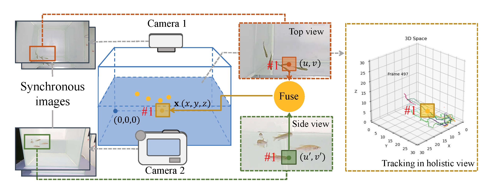

# ZebrafishTracking
This repo is for the paper "Online 3D Reconstruction of Zebrafish Behavioral Trajectories within A Holistic Perspective" on IEEE BIBM22.

**Abstract** Recording activities of zebrafish is a fundamental task in biological research that aims to accurately track individuals and recover their real-world movement trajectories from multiple viewpoint videos. In this paper, we propose a novel online tracking solution based on a holistic perspective that leverages the correlation of appearance and location across views. It first reconstructs the 3D coordinates of targets frame by frame and then tracks them directly in 3D space instead of a 2D image plane. However, it is not trivial to implement such a solution which requires the association of targets across views and neighboring frames under occlusion and parallax
distortion. To cope with that, we propose the view-invariant feature representation and the Kalman filter-based 3D state estimation, and combine the advantages of both to generate robust 3D trajectories. Extensive experiments on public datasets verify the efficiency and effectiveness of the approach.

<!--  -->

# Model
[ResNet-18 backbone](https://drive.google.com/file/d/1joZMPoQjrmwq0DgPy7p0v-bvtJQ3CWwM/view?usp=sharing)
